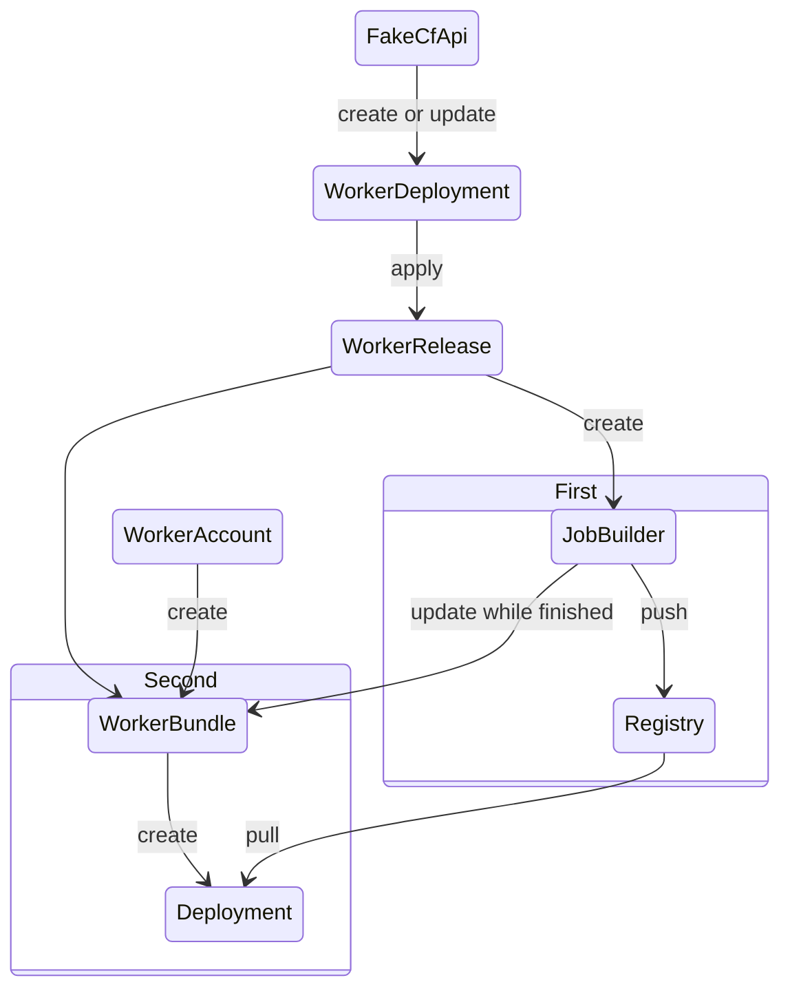

# workerbundle
// TODO(user): Add simple overview of use/purpose

## Description
// TODO(user): An in-depth paragraph about your project and overview of use

## Getting Started
You’ll need a Kubernetes cluster to run against. You can use [KIND](https://sigs.k8s.io/kind) to get a local cluster for testing, or run against a remote cluster.
**Note:** Your controller will automatically use the current context in your kubeconfig file (i.e. whatever cluster `kubectl cluster-info` shows).

### Running on the cluster
1. Install Instances of Custom Resources:

```sh
kubectl apply -f config/samples/
```

2. Build and push your image to the location specified by `IMG`:

```sh
make docker-build docker-push IMG=<some-registry>/workerbundle:tag
```

3. Deploy the controller to the cluster with the image specified by `IMG`:

```sh
make deploy IMG=<some-registry>/workerbundle:tag
```

### Uninstall CRDs
To delete the CRDs from the cluster:

```sh
make uninstall
```

### Undeploy controller
UnDeploy the controller from the cluster:

```sh
make undeploy
```

## Contributing
// TODO(user): Add detailed information on how you would like others to contribute to this project

### How it works
This project aims to follow the Kubernetes [Operator pattern](https://kubernetes.io/docs/concepts/extend-kubernetes/operator/).

It uses [Controllers](https://kubernetes.io/docs/concepts/architecture/controller/),
which provide a reconcile function responsible for synchronizing resources until the desired state is reached on the cluster.

### Test It Out
1. Install the CRDs into the cluster:

```sh
make install
```

2. Run your controller (this will run in the foreground, so switch to a new terminal if you want to leave it running):

```sh
make run
```

**NOTE:** You can also run this in one step by running: `make install run`

### Modifying the API definitions
If you are editing the API definitions, generate the manifests such as CRs or CRDs using:

```sh
make manifests
```

**NOTE:** Run `make --help` for more information on all potential `make` targets

More information can be found via the [Kubebuilder Documentation](https://book.kubebuilder.io/introduction.html)

## Architecture



### WorkerDeployment

```yaml
apiVersion: api.worker-deployment/v1alpha1
kind: WorkerDeployment
metadata:
  name: "1234" # accounts
  labels:
    accounts: "1234"
spec:
  template:
      scriptName: wasm-worker
      secretRef: "secret-accounts-ref" # prefix WASM_WORKER_ toutes les var d'env
      compatibilityDate: "MM/DD/YYYY"
      scriptUrls:
        - "s3://path/to/dir/version/files1"
        - "s3://path/to/dir/version/files2"
  releaseHistoryLimit: 10 # ne pas avoir trop de release
```

### WorkerRelease
regrouper plusieurs workerRelease par accounts

rebuild: chgement du code, secrets, env, comp date...
```yaml
apiVersion: api.worker-release/v1alpha1
kind: WorkerRelease
metadata:
  name: "1234" # accounts
  labels:
    accounts: "1234"
spec:
  scriptName: wasm-worker
  secretRef: "secret-accounts-ref" # prefix WASM_WORKER_ toutes les var d'env
  compatibilityDate: "MM/DD/YYYY"
  scriptUrls: 
    - "s3://path/to/dir/version/files1"
    - "s3://path/to/dir/version/files2"
```

### WorkerBundle: unique
```yaml
apiVersion: api.worker-bundle/v1alpha1
kind: WorkerBundle
metadata:
  name: "1234" # accounts
  labels:
    accounts: "1234"
  annotations: # purge des images
    lastImage: "1234:v1" # delete if v2 done
spec:
  deploymentName: "deplName"
  workers:
    - workerName: wasm-worker 
      workerNumber: 8080
      envPrefix: WASM_WORKER_
      secretRef: "secret-accounts-ref" # prefix WASM_WORKER_ toutes les var d'env
    - workerName: artist-worker
      workerNumber: 8081
      envPrefix: ARTIST_WORKER_
      secretRef: "secret-accounts-ref"
  podTemplate:
    image: "1234:v2" # accounts
    imagePullSecret: "insert-secret-here"

```

### WorkerAccount
qui va ou?
créé statiquement pour juste référencer le bundle avec l'accounts
```yaml
apiVersion: api.worker-account/v1alpha1
kind: WorkerAccount
metadata:
  name: "1234" # accounts
  labels:
    accounts: "1234"
spec:
  workerBundleName: "workerBundleName"
  workerReleaseSelector: 
    matchLabels: 
      accounts: "1234"
  podTemplate:
    imagePullSecret: "insert-secret-here"
```
    

## License

Copyright 2023 clementreiffers.

Licensed under the Apache License, Version 2.0 (the "License");
you may not use this file except in compliance with the License.
You may obtain a copy of the License at

    http://www.apache.org/licenses/LICENSE-2.0

Unless required by applicable law or agreed to in writing, software
distributed under the License is distributed on an "AS IS" BASIS,
WITHOUT WARRANTIES OR CONDITIONS OF ANY KIND, either express or implied.
See the License for the specific language governing permissions and
limitations under the License.

